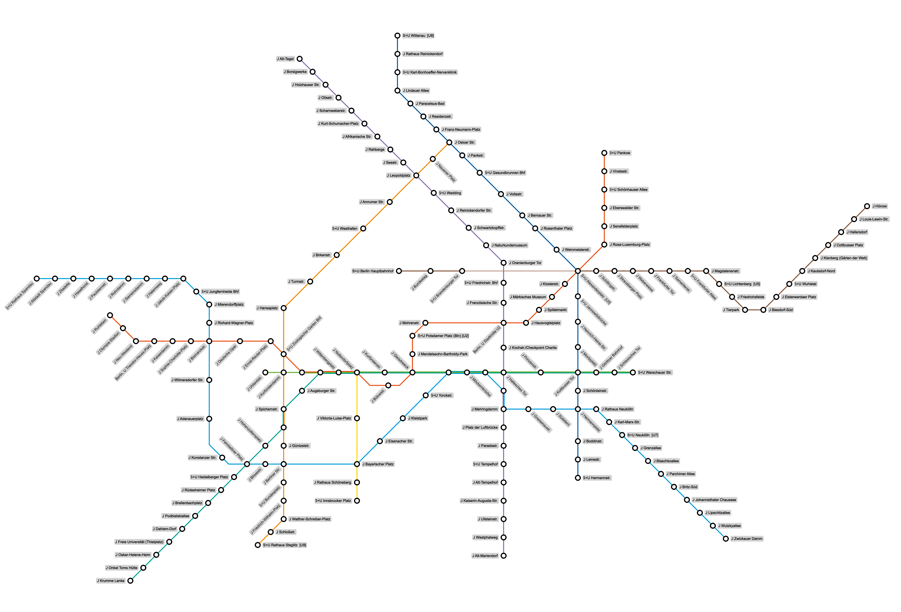
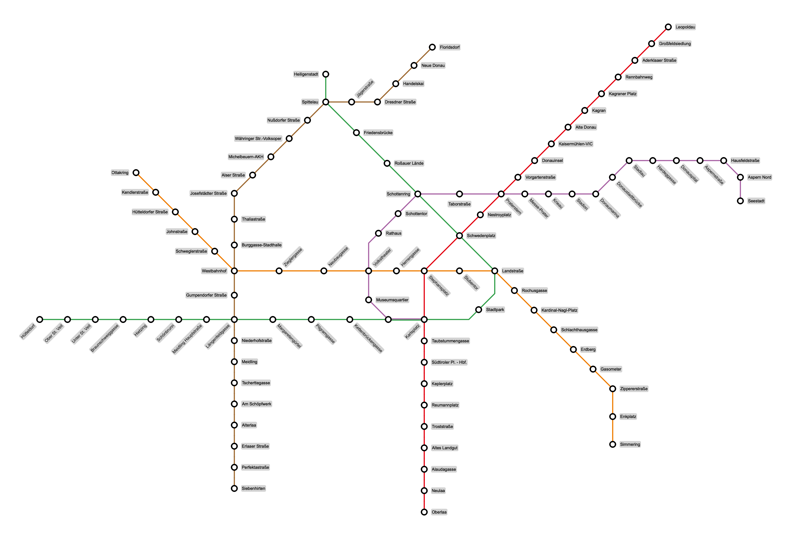
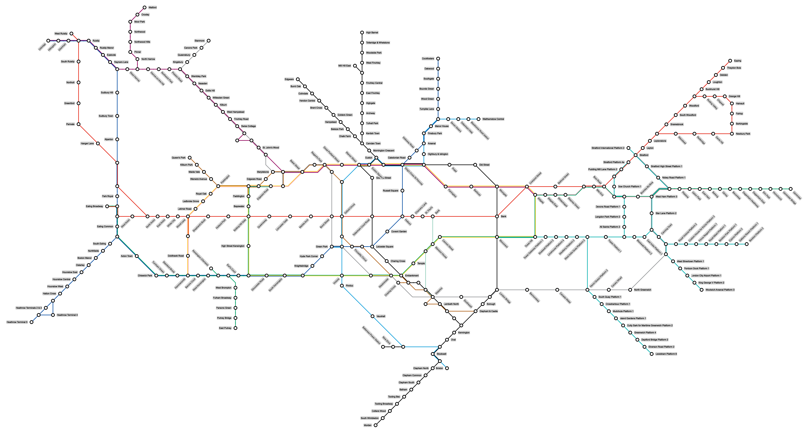
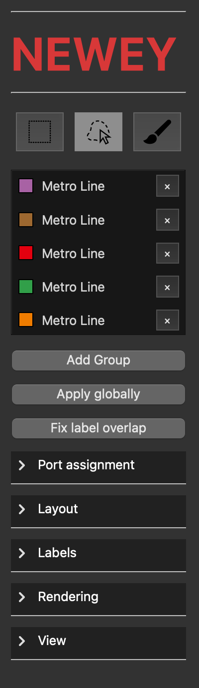
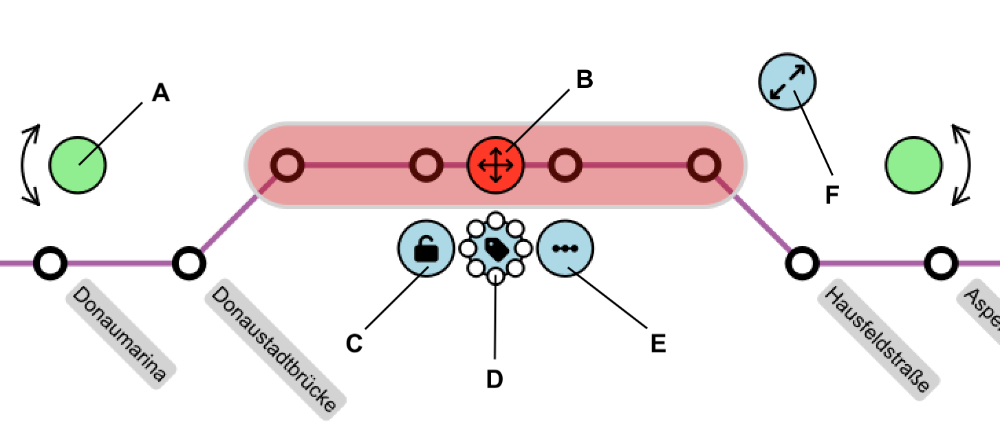

# Newey: An Algorithmically-Assisted Editor for High-Quality Fully Labelled Transit Map Layouts

<p align="center">
  
  
  
</p>

*Figure 1: A labelled octolinear schematic transit map of the Berlin U-bahn, Viena Metro and London Underground created fully within Newey.*

-------


[-INSERT DEMO VIDEO-]

**Abstract**

Transit maps visualize geospatial graphs such as metro-, tram- and bus-networks, and are canonically schematized using octolinear layouts. Recently, Van Dijk and Terziadis released a graphical user interface for schematic transit map design that provides the user with a compelling set of algorithmically-assisted interactions based on *port assignments* -- solving or sidestepping the issues of computational complexity and formalization by including a human in the loop. As is often the case for automated transit map design systems, the editor focuses solely on the graph layout problem without considering the need to actually label the stations. In this paper we describe a significantly more capable editor that increases usability and practical relevance in two ways. First, we demonstrate that labeling can be seamlessly integrated in the existing port assignment framework, with efficient and meaningful algorithmic assistance. Secondly, we introduce various novel ways of interacting with the port assignment, providing several intuitive user interactions within the framework (for example: dragging nodes, and scaling and pivoting selections).

# Installation

First, create and activate a Python virtual environment. Then install all required dependencies using the provided `requirements.txt` file:

```bash
pip install -r requirements.txt
```

After the installation has completed, start the application by running:

```bash
python main.py
```

# Usage

> [!NOTE] 
> When first starting the application, it may take some time to load. Just sit back and relax!

When starting the application, you are presented with a schematic version of the Vienna metro map. This initial layout has already been generated using both the port-assignment ILP and the layout LP, with default parameters set to, Horizontal label weight: 5% and Consistency weight: 10%. 

From this starting point, the user can pan and zoom across the canvas to explore the network. Zooming can be performed by scrolling the mouse wheel or by pinching on a touchpad. Panning is possible by pressing and holding the middle mouse button or by using a two-finger gesture on the touchpad. The network can also be edited interactively in several ways. For example, users can drag and drop nodes to reposition them or manipulate an entire degree-2 string at once. Additional options are available in the left-side menu and the group context menus, both of which are explained in the sections below. A different file can be opened through the top navigation bar, which is also described in more detail later.

--------

# Left Menu
<p align="center">
  
</p>

## Selection Tools

The rectangle, lasso, and brush tools can be used to select groups of stations. Once a group is selected, an interactive group menu appears directly in the canvas (see *Group Menu* below).

## Current Groups

This panel displays all currently defined groups in the network. When loading a new GeoJSON file, all metro lines contained in the data are automatically added as groups.

Clicking a group:
* highlights it in the canvas
* reveals its current parameter settings
* allows interactive parameter manipulation on the group

## Add Group

When a group is selected, pressing 'Add Group' opens a dialog to create and name a new group. The group is then added to the group list for later reuse.

## Apply Globally

Runs the port-assignment ILP and layout LP on all **unlocked** parts of the network using the currently selected global parameters.

This button is also used after loading a new GeoJSON file to generate an initial schematic layout from the geographic data.

## Fix Label Overlap

Runs the post-processing label overlap ILP. This can be used after layout generation if label overlaps are still present.

## Port Assignment Section

Contains sliders and settings for global port-assignment behaviour, including:

* bend penalty
* labeling preference
* port-assignment solving strategies

Different solving strategies can be selected here. The default **Global** method is recommended in most cases. However, for some datasets (e.g., London Underground data), it may become infeasible, in which case the 'matching' method can be used instead.

## Layout Section

Contains global layout controls such as:

* minimum edge length
* label distance

Changes are applied interactively.

## View Section

Contains viewport and visualization settings, including:

* toggling the original geographic layout in the background
* zoom-to-fit functionality

--------

# Group Menu

When a group is selected, several interactive controls appear directly on the canvas.



## Green Pivot Handles (A)

Groups can be pivoted around edge stations inside the group. An edge station is a station connected to nodes outside the group. For each outgoing connection, a green pivot handle appears along the edge direction. Dragging one of these handles rotates the entire group around the corresponding edge station.

## Red Move Handle (B)

The red handle at the center of the group allows the entire group to be moved relative to the surrounding network while preserving its internal structure. The handle must be dragged to activate the movement.

## Blue Lock Button (C)

Locks the current port assignment of the group.

The port assignment of locked groups are unaffected by global parameter changes.

## Blue Label Radial Menu (D)

Clicking the label button recomputes the labeling for the selected group using its current labeling parameters.

The surrounding radial buttons can be used to force all labels in the group toward a specific direction.

## Blue Straighten / Circularise Button (E)

Depending on the structure of the group:

* line-like groups expose a **straighten** button,
* circular groups expose a **circularise** button.

The straighten operation aligns internal connections into a straighter configuration, while the circularise operation attempts to reshape the group into a circular structure through port reassignment.

## Blue Resize Handle (F)

Dragging the resize handle inward or outward changes the minimum and maximum edge lengths within the group, allowing the group to become more compact or more spacious.

-----------

# Top Navigation Bar


## Save File (`CTRL/CMD + S`)

Saves the current project as a `.mooey` file in the current working directory.

## Load File (`CTRL/CMD + O`)

Loads:

* GeoJSON network files (`.json`),
* previously saved `.mooey` projects.

## Take Picture (`CTRL/CMD + P`)

Exports the current canvas as a `.png` image using the current project name.

## Undo / Redo

* **Undo:** `CTRL/CMD + Z`
* **Redo:** `SHIFT + CTRL/CMD + Z`

Reverts or reapplies edits made to the network.
